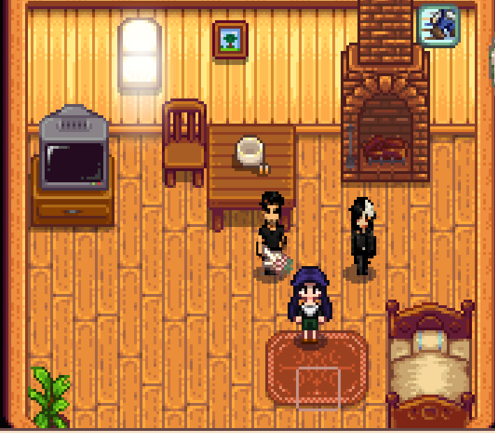

# Stardew MCP Bridge

AI companions for Stardew Valley, controlled through the [Model Context Protocol](https://modelcontextprotocol.io). Spawn one or more autonomous NPC companions with custom sprites that can follow the player, farm, mine, fish, and fight — all driven by MCP tool calls from an AI agent.



## Architecture

```
┌──────────────┐    stdio     ┌──────────────┐   JSON files   ┌──────────────┐
│  AI Agent    │◄────────────►│  MCP Server  │◄──────────────►│  SMAPI Mod   │
│ (Claude etc) │              │  (Node.js)   │                │  (C# / .NET) │
└──────────────┘              └──────────────┘                └──────┬───────┘
                                                                     │
                                                              ┌──────▼───────┐
                                                              │ Stardew      │
                                                              │ Valley Game  │
                                                              └──────────────┘
```

**SMAPI Mod** (`smapi-mod/`): Runs inside the game. Spawns companion NPCs with shadow `Farmer` instances for game mechanics (tools, combat, fishing). Writes game state to `bridge_data.json`, reads commands from `actions.json`.

**MCP Server** (`mcp-server/`): Exposes 13 tools over stdio transport. Reads game state and sends commands by reading/writing the bridge JSON files.

## Companion System

Each companion is a visible NPC paired with a hidden "shadow farmer" that handles game mechanics:

- **NPC** — Custom sprite, pathfinding, visible to the player
- **Shadow Farmer** — Extends `Farmer` class, holds tools/inventory, performs tool use, combat, and fishing through actual game APIs

### Modes

| Mode | Behavior |
|------|----------|
| `follow` | Follow the player between locations, fight if monsters nearby |
| `farm` | Scan for crops to water/harvest, clear debris |
| `mine` | Fight monsters, break rocks, seek ladders |
| `fish` | Find water, cast rod, auto-hook fish |
| `idle` | Stay in place |

## MCP Tools

| Tool | Description |
|------|-------------|
| `stardew_get_state` | Get current game state (time, weather, player stats, companion status) |
| `stardew_spawn` | Spawn companions near the player |
| `stardew_follow` | Set all companions to follow mode |
| `stardew_stay` | Set all companions to idle |
| `stardew_farm` | Enable autonomous farming |
| `stardew_mine` | Enable combat/mining mode |
| `stardew_fish` | Enable fishing mode |
| `stardew_water_all` | Instantly water all unwatered crops |
| `stardew_harvest_all` | Instantly harvest all ready crops |
| `stardew_warp` | Warp companions to a location |
| `stardew_set_mode` | Set an individual companion's mode |
| `stardew_chat` | Send a message to the game chat |
| `stardew_action` | Send a custom action command |

## Setup

### Prerequisites

- [Stardew Valley](https://www.stardewvalley.net/) (1.6+)
- [SMAPI](https://smapi.io/) (4.0+)
- [Node.js](https://nodejs.org/) (18+)

### 1. Build the SMAPI Mod

```bash
cd smapi-mod

# Set your Stardew Valley install path
export GAME_PATH="C:/Program Files/Steam/steamapps/common/Stardew Valley"

dotnet build
```

The build will automatically deploy to your `Mods/` folder.

### 2. Add Companion Assets

Place your custom sprites and portraits in `smapi-mod/assets/`:

- `Companion1_sprite.png` — 64x128 sprite sheet (4x4 grid, 16x32 per frame)
- `Companion1_portrait.png` — Portrait image
- `Companion2_sprite.png` — 64x128 sprite sheet
- `Companion2_portrait.png` — Portrait image

Sprite sheets follow the standard Stardew Valley format: 4 columns (walk frames) x 4 rows (down, right, up, left).

### 3. Build the MCP Server

```bash
cd mcp-server
npm install
npm run build
```

### 4. Configure Your AI Agent

Add to your MCP client config (e.g., Claude Code's `settings.json`):

```json
{
  "mcpServers": {
    "stardew": {
      "command": "node",
      "args": ["path/to/mcp-server/build/index.js"],
      "env": {
        "STARDEW_BRIDGE_PATH": "path/to/Mods/StardewMCPBridge/bridge_data.json",
        "STARDEW_ACTION_PATH": "path/to/Mods/StardewMCPBridge/actions.json"
      }
    }
  }
}
```

If you're running both from the repo directory, the env vars are optional — it defaults to `../../smapi-mod/` relative paths.

### 5. Play

1. Launch Stardew Valley with SMAPI
2. Load a save
3. Use `stardew_spawn` to bring companions into the world
4. Set modes with `stardew_farm`, `stardew_mine`, `stardew_fish`, or `stardew_follow`

## Project Structure

```
stardew-mcp-bridge/
├── smapi-mod/
│   ├── ModEntry.cs           # SMAPI entry point, content pipeline, bridge I/O
│   ├── BotManager.cs         # Companion lifecycle, action routing
│   ├── CompanionAI.cs        # AI behavior system (follow/farm/mine/fish/idle)
│   ├── CompanionFarmer.cs    # NPC + shadow farmer pairing, tool/combat/fishing
│   ├── CompanionActions.cs   # Direct tile manipulation (water/harvest/clear/hoe)
│   ├── BotFarmer.cs          # Shadow Farmer subclass for game mechanics
│   ├── manifest.json         # SMAPI mod manifest
│   ├── StardewMCPBridge.csproj
│   └── assets/               # Sprites and portraits
├── mcp-server/
│   ├── src/index.ts          # MCP server with 13 tools
│   ├── package.json
│   └── tsconfig.json
├── .gitignore
└── README.md
```


## License

MIT

## Credits

Built with Antigravity & Claude Code — Kai & Lucian, with Mai.

Shadow farmer pattern inspired by [Farmtronics](https://github.com/JoeStrout/Farmtronics).


---


 ## Support

  If this helped you, consider supporting my work ☕

  [](https://ko-fi.com/maii983083)
